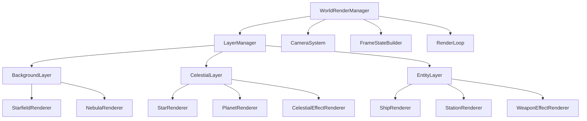

# StarAxis前端渲染分层架构设计文档

**日期**：2026-04-10
**主题**：前端渲染分层架构
**状态**：已批准
**作者**：Claude Code

## 1. 项目背景与需求

### 1.1 问题描述
当前StarAxis前端渲染系统采用统一实体组（entitiesGroup）架构，所有渲染对象混合在同一个Three.js Group中喵。这导致：

1. **渲染顺序难以控制**：背景、星体、实体、UI混合渲染，缺乏清晰的视觉层次喵。
2. **代码组织混乱**：不同职责的渲染器混合在一起，职责边界不清晰喵。
3. **性能优化受限**：无法针对不同层级实施独立的LOD、剔除和优化策略喵。

### 1.2 核心需求
1. **渲染顺序控制**：确保正确的遮挡关系（背景在最底层，UI在最顶层）喵。
2. **代码组织优化**：将不同渲染职责分离到不同的模块中喵。
3. **性能优化基础**：为各层提供独立的优化策略空间喵。

## 2. 设计方案概述

### 2.1 架构选择：职责分离的模块化分层
采用**方案2：职责分离的模块化分层**架构，完全重构渲染系统喵。

**核心优势**：
- ✅ **职责清晰**：每层只负责特定类型的渲染内容喵。
- ✅ **渲染顺序固定**：通过Three.js renderOrder属性和Group层级保证喵。
- ✅ **独立优化**：每层可以有自己的可见性、LOD、剔除逻辑喵。
- ✅ **易于扩展**：新特效、新实体类型可自然添加到对应层级喵。

### 2.2 整体架构图
```
WorldRenderManager (协调器)
├── BackgroundLayer (背景层, renderOrder: 0)
│   ├── StarfieldRenderer (星空渲染)
│   ├── NebulaRenderer (星云渲染)
│   └── DeepSpaceEffectRenderer (深空特效)
│   └── BackgroundLayerStateManager (状态管理)
├── CelestialLayer (星体层, renderOrder: 1)
│   ├── StarRenderer (恒星渲染) ← 现有重构
│   ├── PlanetRenderer (行星渲染) ← 现有重构
│   ├── CelestialEffectRenderer (星体特效)
│   └── CelestialLayerStateManager (状态管理)
├── EntityLayer (实体层, renderOrder: 2)
│   ├── ShipRenderer (舰船渲染) ← 现有重构
│   ├── StationRenderer (空间站渲染)
│   ├── BuildingRenderer (太空建筑渲染)
│   ├── WeaponEffectRenderer (武器特效)
│   └── EntityLayerStateManager (状态管理)
└── UILayer (UI层, renderOrder: 3)*
    ├── ThreeJsUIOverlay (Three.js UI覆盖)
    └── VueUIIntegration (Vue UI集成)
```

*注：UI层分为两部分：1) Three.js UI覆盖层，用于渲染与游戏世界相关的UI元素（如选择框、标记）；2) Vue UI集成层，使用现有Vue组件系统，通过CSS z-index控制显示在Three.js画布上方喵。本方案主要关注Three.js渲染层喵。*

## 3. 详细设计

### 3.1 分层架构设计

#### 3.1.1 渲染顺序定义
```typescript
// 渲染顺序值（越小越先渲染）
export const RenderOrder = {
    BACKGROUND: 0,    // 背景层：星空、星云等
    CELESTIAL: 1,     // 星体层：恒星、行星等
    ENTITY: 2,        // 实体层：舰船、建筑、空间站
    EFFECT: 3,        // 实体特效：武器光束、爆炸等
    SELECTION: 4,     // 选择框：实体选择标记
    UI_OVERLAY: 5,    // Three.js UI覆盖层
} as const
```

#### 3.1.2 层接口设计
```typescript
/**
 * 渲染层接口定义
 * 所有渲染层必须实现此接口喵。
 */
export interface RenderLayer {
    readonly name: string
    readonly renderOrder: number
    readonly group: THREE.Group

    // 生命周期方法
    init(ctx: WorldRenderContext): Promise<void>
    update(ctx: WorldRenderContext, frame: WorldFrameState): void
    dispose(ctx: WorldRenderContext): void

    // 层控制方法
    setVisible(visible: boolean): void
    isVisible(): boolean
    setQuality(quality: number): void  // 0.0-1.0，控制渲染质量
    getStats(): LayerStats             // 获取层性能统计
}

/**
 * 层管理器接口
 */
export interface LayerManager {
    readonly layers: Map<string, RenderLayer>

    // 层管理
    registerLayer(layer: RenderLayer): void
    unregisterLayer(name: string): void
    getLayer(name: string): RenderLayer | null

    // 批量操作
    updateAll(ctx: WorldRenderContext, frame: WorldFrameState): void
    setAllVisible(visible: boolean): void
    disposeAll(ctx: WorldRenderContext): void
}
```

### 3.2 各层详细设计

#### 3.2.1 BackgroundLayer (背景层)
**职责范围**：
- 静态/动态星空背景渲染
- 星云、气体云等深空效果
- 背景视差滚动效果

**优化策略**：
- 使用预先生成的星空图纹理
- 低频率更新（仅在相机移动时更新）
- 禁用详细LOD，始终使用高质量渲染

**渲染器组成**：
- `StarfieldRenderer`: 星空背景渲染器
- `NebulaRenderer`: 星云效果渲染器
- `DeepSpaceEffectRenderer`: 深空特效（如超新星残骸）

#### 3.2.2 CelestialLayer (星体层)
**职责范围**：
- 恒星、行星等天体渲染
- 天体特效（光环、日冕、轨迹）
- 天体LOD管理

**现有系统集成**：
- 重构现有`StarRenderer`，保持对象池、纹理管理等优化喵。
- 重构现有`PlanetRenderer`，保留拖尾特效等高级功能喵。
- 新增`CelestialEffectRenderer`处理通用星体特效喵。

**LOD策略**：
- 继承现有的LOD系统，但调整为层内专用喵。
- 根据缩放级别动态调整纹理质量和细节喵。

#### 3.2.3 EntityLayer (实体层)
**职责范围**：
- 舰船、空间站、太空建筑渲染
- 实体特效（引擎光效、武器光束、爆炸）
- 实体选择和标记渲染

**现有系统集成**：
- 重构现有`ShipRenderer`为EntityLayer的子渲染器喵。
- 将`SelectionRenderer`整合到EntityLayer，处理实体选择和标记喵。
- 新增`WeaponEffectRenderer`、`ExplosionRenderer`等特效渲染器喵。

**优化策略**：
- 按实体类型分组渲染，提高批次效率喵。
- 根据距离实施动态LOD，近距离高质量，远距离简化喵。

### 3.3 与现有系统集成

#### 3.3.1 WorldRenderManager改造
保持现有公共API不变，内部重构为分层架构：

```typescript
// 改造后的WorldRenderManager内部结构
export function createWorldRenderManager(container, options) {
    // 创建相机系统（保持不变）
    const cameraSystem = createCameraSystem(container)

    // 创建层管理器
    const layerManager = createLayerManager()

    // 注册各层
    layerManager.registerLayer(new BackgroundLayer())
    layerManager.registerLayer(new CelestialLayer())
    layerManager.registerLayer(new EntityLayer())

    // 保留现有API
    return {
        // 现有API（保持不变）
        zoom,
        cameraWorldPosGU,
        setZoom,
        applyCameraTransform,
        getCullingAabbGU,
        setSelectedEntityIds,
        updateFromSnapshot,
        removeEntitiesFromCache,
        removeSectorsFromCache,
        getEntityWorldPosGU,
        setCurrentNationId,
        setGridVisible,
        onCameraChanged,
        dispose,

        // 新增层控制API（可选）
        getLayer: (name) => layerManager.getLayer(name),
    }
}
```

#### 3.3.2 现有子系统重构路径
**渐进式迁移策略**：

1. **阶段1：架构搭建** - 创建Layer接口和基础结构喵。
2. **阶段2：星体层迁移** - 迁移StarRenderer和PlanetRenderer喵。
3. **阶段3：实体层迁移** - 迁移ShipRenderer和SelectionRenderer喵。
4. **阶段4：背景层实现** - 实现星空、星云渲染喵。
5. **阶段5：特效层扩展** - 添加武器特效、爆炸特效等喵。

**关键兼容保证**：
- ✅ **API向后兼容**：现有调用代码无需修改喵。
- ✅ **功能完整性**：迁移过程中所有功能正常工作喵。
- ✅ **性能不降级**：重构后性能不低于原有系统喵。

## 4. 技术实现细节

### 4.1 Three.js渲染顺序控制

#### 4.1.1 Group层级结构
```typescript
// 相机系统创建分层Group
const backgroundGroup = new THREE.Group()
backgroundGroup.renderOrder = RenderOrder.BACKGROUND

const celestialGroup = new THREE.Group()
celestialGroup.renderOrder = RenderOrder.CELESTIAL

const entityGroup = new THREE.Group()
entityGroup.renderOrder = RenderOrder.ENTITY

// 添加到场景
worldGroup.add(backgroundGroup)
worldGroup.add(celestialGroup)
worldGroup.add(entityGroup)
```

#### 4.1.2 材质渲染顺序
对于需要特殊渲染顺序的材质（如透明特效），通过材质属性控制：

```typescript
// 特效材质示例
const effectMaterial = new THREE.ShaderMaterial({
    transparent: true,
    depthTest: true,
    depthWrite: false,
    blending: THREE.AdditiveBlending,
    renderOrder: RenderOrder.EFFECT, // 指定渲染顺序
})
```

### 4.2 状态管理设计

#### 4.2.1 层状态隔离
每层维护独立的状态对象，避免跨层状态污染：

```typescript
class CelestialLayer implements RenderLayer {
    private state: {
        visible: boolean
        quality: number
        activeEntities: Set<number>
        lodState: CelestialLodState
    }

    // 层内状态管理方法
    private updateLod(ctx: WorldRenderContext): void { /* ... */ }
    private cullEntities(frame: WorldFrameState): void { /* ... */ }
}
```

#### 4.2.2 全局状态共享
通过WorldFrameState共享只读全局状态：

```typescript
// 帧状态包含所有层需要的全局数据
export type WorldFrameState = {
    snapshot: SnapshotMessage | null
    entitiesById: Map<number, EntitySnapshot>
    sectorCenters: { q: number; r: number; x: number; y: number }[]
    selectedIds: Set<number>
    cullingAabb: { minX: number; maxX: number; minY: number; maxY: number }
    totalDays: number
    // 各层可以添加自己的专用状态
    backgroundState?: BackgroundState
    celestialState?: CelestialState
    entityState?: EntityState
}
```

### 4.3 性能优化策略

#### 4.3.1 分层更新频率
- **背景层**：低频率更新（1Hz），仅在相机移动时更新喵。
- **星体层**：中频率更新（10Hz），LOD变化时更新喵。
- **实体层**：高频率更新（60Hz），跟随渲染循环喵。

#### 4.3.2 内存管理
- **纹理按层加载**：背景层使用大尺寸压缩纹理，实体层使用小尺寸高质量纹理喵。
- **对象池分层**：每层维护独立的对象池，避免跨层对象混用喵。
- **按需加载**：离屏层可以延迟加载或使用低质量资源喵。

#### 4.3.3 渲染批次优化
- **按层分组**：相同层的相似对象可以批量渲染喵。
- **材质共享**：层内相似材质可以共享，减少WebGL状态切换喵。
- **实例化渲染**：大量重复实体（如小行星）可以使用实例化渲染喵。

## 5. 实施计划

### 5.1 阶段分解

#### 阶段1：架构搭建（预计1-2天）
1. 创建`src/rendering/layers/`目录结构喵。
2. 定义`RenderLayer`和`LayerManager`接口喵。
3. 实现`BaseLayer`抽象类和`SimpleLayerManager`喵。
4. 改造`WorldRenderManager`支持多层架构喵。

#### 阶段2：星体层迁移（预计2-3天）
1. 创建`CelestialLayer`类喵。
2. 重构`StarRenderer`适配层接口喵。
3. 重构`PlanetRenderer`适配层接口喵。
4. 测试星体层渲染顺序和性能喵。

#### 阶段3：实体层迁移（预计2-3天）
1. 创建`EntityLayer`类喵。
2. 重构`ShipRenderer`适配层接口喵。
3. 整合`SelectionRenderer`到实体层喵。
4. 测试实体层选择和标记功能喵。

#### 阶段4：背景层实现（预计2-3天）
1. 创建`BackgroundLayer`类喵。
2. 实现`StarfieldRenderer`星空渲染器喵。
3. 实现`NebulaRenderer`星云渲染器喵。
4. 测试背景层视差滚动效果喵。

#### 阶段5：特效层扩展（预计1-2天）
1. 创建特效渲染器基础类喵。
2. 实现`WeaponEffectRenderer`武器特效喵。
3. 实现`ExplosionRenderer`爆炸特效喵。
4. 测试特效与实体的交互喵。

#### 阶段6：优化和测试（预计1-2天）
1. 性能分析和优化喵。
2. 内存泄漏检查喵。
3. 边缘情况测试喵。
4. 文档更新和代码审查喵。

### 5.2 风险评估与缓解

#### 风险1：渲染性能下降
- **可能性**：低喵。
- **影响**：高喵。
- **缓解措施**：逐步迁移，每阶段进行性能测试喵。保留回滚机制喵。

#### 风险2：现有功能损坏
- **可能性**：中喵。
- **影响**：高喵。
- **缓解措施**：保持API兼容性，完整测试套件喵。逐步验证每个功能喵。

#### 风险3：内存使用增加
- **可能性**：中喵。
- **影响**：中喵。
- **缓解措施**：每层独立内存管理，及时释放未使用资源喵。监控内存使用喵。

## 6. 验收标准

### 6.1 功能验收标准
1. ✅ **渲染顺序正确**：背景层在最底层，UI层在最顶层喵。
2. ✅ **各层内容正确**：星体层只渲染星体，实体层只渲染实体喵。
3. ✅ **现有功能完整**：选择、标记、拖尾等所有现有功能正常工作喵。
4. ✅ **新增功能可用**：背景层、特效层按设计工作喵。

### 6.2 性能验收标准
1. ✅ **帧率稳定**：在标准测试场景下，重构后帧率不低于原有系统的95%喵。
2. ✅ **内存可控**：在相同场景下，内存使用增加不超过10%喵。
3. ✅ **加载时间**：首次加载时间增加不超过15%喵。
4. ✅ **渲染批次优化**：相同场景下，WebGL绘制调用次数不增加喵。

### 6.3 代码质量标准
1. ✅ **类型安全**：TypeScript编译无错误喵。
2. ✅ **接口清晰**：各层接口定义明确喵。
3. ✅ **文档完整**：关键接口和类有完整注释喵。

## 7. 附录

### 7.1 文件结构规划
```
src/rendering/
├── layers/                    # 分层架构核心
│   ├── index.ts              # 层接口导出
│   ├── baseLayer.ts          # 基础层抽象类
│   ├── layerManager.ts       # 层管理器
│   ├── background/           # 背景层
│   │   ├── index.ts
│   │   ├── backgroundLayer.ts
│   │   └── renderers/
│   ├── celestial/            # 星体层
│   │   ├── index.ts
│   │   ├── celestialLayer.ts
│   │   └── renderers/
│   └── entity/               # 实体层
│       ├── index.ts
│       ├── entityLayer.ts
│       └── renderers/
├── worldRenderManager.ts     # 改造后的渲染管理器
└── (其他现有文件保持不变)
```

### 7.2 依赖关系图


---

**文档状态**：设计完成，等待用户审查喵。

**下一步**：用户审查通过后，将创建详细的实现计划喵。