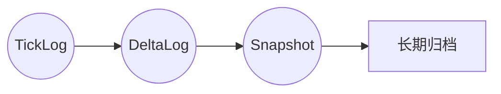
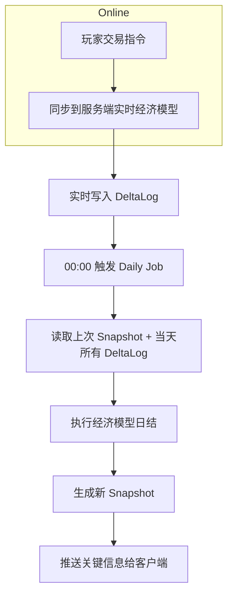

# 数据记录与结算分析（V1 草案）

> 版本：2026-01-12
> 
> 本文档界定 **StarAxis** 的“数据记录(Data Logging)”与“结算(Settlement/Batch Processing)”的统一口径，确保在**单机 / 联机 / 云端大世界**三种运行模式下都能：
>
> 1. **可追溯** —— 发生过的关键事件、指标可查询、可回放、可审计。
> 2. **可压缩** —— 历史记录占用空间可控，并支持归档与冷存储。
> 3. **可结算** —— 周期性/触发式结算逻辑在规定时间内完成，保证经济、战斗、科研等系统一致。
>
> ⚠️ 本规范**不**涵盖实时日志/监控（见《工程与流程/可观测性与调试.md》），也不代替回放文件规范（见《核心逻辑/回放与确定性.md》）。

---

## 1. 关键概念

| 名称 | 说明 |
|------|------|
| Tick | 服务器权威推进最小时间步；本项目采用 **100ms** Tick。 |
| Snapshot | 按固定间隔(1 秒)输出的世界全局摘要，用于回放及快速加载。 |
| DeltaLog | 两个 Snapshot 之间，对象属性变化/事件的增量记录。 |
| Daily Settlement | 每日 00:00 UTC 触发的日结算流程（经济、人口、科研）。 |
| Batch Job | 大于 Tick 粒度的离线批处理任务，例如 NPC 贸易路由优化，每 10 分钟一次。 |

---

## 2. 数据记录层级



1. **TickLog（细粒度）**  
   - 每 Tick 追加一次；记录指令执行、关键系统输出 Hash。
   - 保留 24h（用于分歧定位）。
2. **DeltaLog（增量）**  
   - 默认 1 秒聚合一次；记录对象属性变化、经济交易、战斗伤害等。
   - 保留 7 天，之后压缩。
3. **Snapshot（全量）**  
   - 默认 5 分钟一次；包含所有对象关键字段，可单独加载。
   - 保留近 3 个版本周期，其余归档。

---

## 3. 结算分类

| 类型 | 触发方式 | 范围 | 时限 |
|------|----------|------|------|
| **日结算** | 每日 00:00 UTC | 经济、人口、科研、势力声望 | 30 秒内完成 |
| **周期结算** | 自定义周期（如 10min）| NPC 路由、市场价格平滑 | 5 秒内 |
| **即时结算** | 指令触发 | 交易、战斗结算 | 单 Tick 内 |

结算必须满足 **Deterministic + Idempotent**：同一输入在重跑或重放时结果一致；允许服务端重试。

---

## 4. 数据流示例（经济日结算）



---

## 5. 存储方案

| 层级 | 存储介质 | 写入模式 | 归档策略 |
|------|-----------|----------|----------|
| TickLog | Redis Stream / Kafka | Append-only | 24h 滚动删除 |
| DeltaLog | PostgreSQL / Parquet | Bulk Insert | 7 天后冷存 S3 |
| Snapshot | 对象存储 (S3) | Replace | 版本迭代后冷存 |

> **注**：离线工具读取 Snapshot + DeltaLog 可重建任意历史状态。

---

## 6. 失败与恢复

- **TickLog 丢失**：用 Snapshot+DeltaLog 回放恢复；分辨率降为 1 秒。  
- **DeltaLog 丢失**：带管理员告警，回放精度下降，需手动修补。  
- **Snapshot 损坏**：回退到上一份 Snapshot + 后续 DeltaLog 重放。

---

## 7. 接口定义

```go
// 追加 Tick 日志
POST /log/tick { tickId, shardId, hash, cmds[] }

// 追加 Delta 日志
POST /log/delta { fromTick, toTick, changes[] }

// 触发结算（内部调度）
POST /settlement/daily { dateUTC }
```

---

## 8. 安全与审计

- 所有日志带 **签名 & Hash**，可验证篡改。  
- Snapshot 保存前计算 **Merkle Root**，并写入链上（可选）。  
- 结算流程输出审计事件：`JOB_START/JOB_END`，含耗时与行数。

---

## 9. 待办

- [ ] 定义变更字段集合与序列化格式 (FlatBuffer / JSON Lines)。  
- [ ] 完善 NPC 运输周期结算公式。  
- [ ] 编写 Cold Storage 归档/恢复脚本示例。
