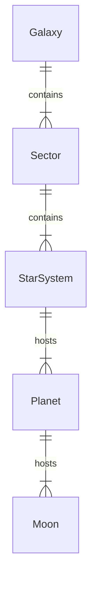

# data-model.md — 数据模型

> 基于 research.md 的决策，定义宇宙生成的数据实体、字段与约束。

---

## 6. ID 生成策略
所有实体 ID（`Galaxy.id`, `StarSystem.id` 等）均采用 64-bit `ulong` 类型，由 `(galaxySeed << 32) | entityIndex` 确定性生成，确保在同一宇宙内绝对唯一。

## 7. Mod 扩展性
为支持 Mod 添加自定义数据，所有核心实体（StarSystem, Planet, Moon）将包含一个 `Dictionary<string, object> modData` 字段，用于存储非官方数据。该字段在序列化时一并处理。

## 8. 持久化与版本管理
- **格式**: 宇宙数据持久化为 `.unv` 文件，采用 MessagePack 二进制序列化。
- **版本**: 文件头部将包含一个 `uint16` 版本号。`UniverseRuntime` 在加载时会检查版本，若不匹配则尝试数据迁移或警告不兼容。

## 9. 数值精度说明
- **风险**: 在 `data-model.md` 中使用 `double` 类型是为了保证计算精度。在序列化及跨平台（特别是 WebGL AOT）时，需注意潜在的精度损失。实现时应在测试环节（见 `spec.md` FR-5）对浮点数比较设置合理容差。

## 1. 实体概览
| 实体 | 说明 | 主要字段 |
|------|------|---------|
| Galaxy | 银河 | id, seed, radiusLy, sectorGridSizeLy, starSystemCount |
| Sector | 星区（六边形） | id, axialQ, axialR, centerLy (Vector3), starSystemIds[] |
| StarSystem | 恒星系 | id, name, sectorId, posLy (Vector3), starType, planetIds[] |
| Planet | 行星 | id, systemId, orbitSemiMajorAxisKm, orbitPeriodDays, radiusKm, moonsIds[] |
| Moon | 卫星 | id, planetId, orbitSemiMajorAxisKm, orbitPeriodDays, radiusKm |

> 坐标系说明：
> - **Galaxy / Sector / StarSystem 级坐标单位 = 光年 (ly)**
> - **Planet / Moon 级轨道半径、天体半径 = 公里 (km)**
> - 渲染层转换：1 px = 1 km，Sector 本地浮点坐标系在 `UniverseRuntime` 层处理。

---

## 2. 字段定义

### 2.1 Galaxy
| 字段 | 类型 | 约束 | 说明 |
|------|------|------|-----|
| id | `ulong` | PK | Snowflake 格式，含种子哈希 |
| seed | `ulong` | required, immutable | 随机种子 |
| radiusLy | `float` | >0 | 银河半径（光年） |
| sectorGridSizeLy | `float` | 3–30 | 六边形边长（光年） |
| starSystemCount | `uint` | computed | 生成恒星系数量 |

### 2.2 Sector
| 字段 | 类型 | 约束 | 说明 |
| axialQ / axialR | `int` | axial 坐标 | 六边形网格索引 |
| centerLy | `float3` | derived | 中心点（光年） |
| starSystemIds | `List<ulong>` | 0..* | 包含恒星系 id |

### 2.3 StarSystem
| 字段 | 类型 | 约束 | 说明 |
| name | `string` | <=32 chars | 系统显示名 |
| sectorId | `ulong` | FK -> Sector | 所属星区 |
| posLy | `float3` | relative to sector | 在 Sector 内局部坐标 (ly) |
| starType | `enum StarType` | G, K, M... | 恒星光谱类型 |
| planetIds | `List<ulong>` | 0..* |

### 2.4 Planet / Moon
公用字段：
| 字段 | 类型 | 约束 | 说明 |
|------|------|------|-----|
| orbitSemiMajorAxisKm | `double` | >0 | 轨道半长轴 (km) |
| orbitPeriodDays | `double` | >0 | 公转周期 (days) |
| radiusKm | `double` | >0 | 天体半径 (km) |

Planet 额外字段：`planetType (enum)`, `moonsIds[]`
Moon 额外字段：`parentPlanetId`

---

## 3. 关系模型


---

## 4. 验证规则
| 编号 | 规则 | 适用实体 | 实现 |
|------|------|---------|-----|
| VR-1 | 行星轨道与周期误差 <2% | Planet | 开普勒第三定律计算后断言 |
| VR-2 | 星区边界半径 σ<5% | Sector | 生成后统计并断言 |
| VR-3 | 坐标精度误差 <1 km | *All* | 转换后误差断言 |

---

## 5. 持久化格式（MessagePack Schema）
```csharp
[MessagePackObject]
public struct StarSystemMp
{
    [Key(0)] public ulong Id;
    [Key(1)] public uint SectorIndex;
    [Key(2)] public float3 PosLy;
    [Key(3)] public byte StarType;
    [Key(4)] public PlanetMp[] Planets;
}
```
*完整 schema 见 `contracts/universe-messagepack.md`*