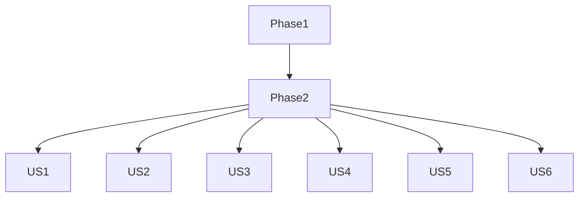

# tasks.md — 012 真实比例宇宙生成（Real-Scale Universe Generation）

> **注意**：所有任务均遵循《StarAxis Constitution》与《游戏大纲.md》规定的模块化、分层与命名规范；术语以《specs/术语对齐.md》为准。

---

## 依赖图

---

## Phase 1 — Setup（项目初始化）

- [ ] T001 创建 `src/universe-generator`、`src/universe-runtime`、`src/editor` 及 `src/rendering` 目录结构
- [ ] T002 在 `src/universe-generator/` 下建立 Assembly Definition `UniverseGenerator.asmdef`
- [ ] T003 在 `src/universe-runtime/` 下建立 Assembly Definition `UniverseRuntime.asmdef`
- [ ] T004 引入 Unity Package `com.unity.collections` 与 `com.unity.burst`（manifest.json）
- [ ] T005 [P] 配置 MessagePack-CSharp（`Packages/manifest.json` + `Assets/Plugins`）
- [ ] T006 [P] 初始化 Git 子模块 `SuperHex` 到 `external/SuperHex`
- [ ] T007 创建 `tests/unit/`、`tests/integration/`、`tests/contract/` 目录

---

## Phase 2 — Foundational（跨故事前置功能）

- [ ] T008 实现 `src/universe-runtime/SegmentId.cs` 定义分段坐标结构体
- [ ] T009 实现 `src/universe-runtime/FloatingOriginSystem.cs` 处理摄像机跨区块重定位
- [ ] T010 [P] 实现 `src/universe-generator/Random/Xoroshiro128Factory.cs` 生成器封装
- [ ] T011 [P] 实现 `src/universe-generator/Hex/GridAxial.cs` 六边形轴向坐标工具
- [ ] T012 实现 `src/universe-generator/Serialization/UniversePack.cs` MessagePack schema（含 StarSystemMp 结构）
- [ ] T013 在 `tests/unit/` 编写 `FloatingOriginTests.cs` 验证误差 <1 km

---

## Phase 3 — User Story 1（US1：生成银河与星区数据 — FR-1 & FR-2）

### 目标
新建存档时，根据配置生成包含若干星系与六边形星区的银河数据，并保存为 `.unv` 文件。

### 可独立测试标准
- 调用 `UniverseGenerator.GenerateGalaxy(seed)` 返回 Galaxy 对象
- 星系间平均距离误差 <1%
- 星区边长标准差 <5%

#### 任务
- [ ] T014 [US1] 在 `src/universe-generator/GalaxyGenerator.cs` 实现银河层级生成算法
- [ ] T015 [P] [US1] 在 `src/universe-generator/Hex/SectorGenerator.cs` 生成星区网格
- [ ] T016 [US1] 在 `src/universe-generator/Serialization/UniverseWriter.cs` 保存 `.unv` 文件
- [ ] T017 [P] [US1] 在 `tests/integration/GalaxyGenerationTests.cs` 验证 FR-1、FR-2 统计规则

---

## Phase 4 — User Story 2（US2：生成恒星系天体与轨道 — FR-3）

### 目标
为每个恒星系生成行星与卫星，轨道数据符合开普勒第三定律，误差 <2%。

### 可独立测试标准
- 随机抽样 100 个行星，轨道周期误差 <2%

#### 任务
- [ ] T018 [US2] 在 `src/universe-generator/Orbital/KeplerCalculator.cs` 实现行星轨道计算
- [ ] T019 [P] [US2] 在 `src/universe-generator/StarSystemGenerator.cs` 生成行星 & 卫星集合
- [ ] T020 [US2] 更新 `UniversePack.cs` 添加 `PlanetMp` / `MoonMp`
- [ ] T021 [P] [US2] 在 `tests/integration/OrbitalTests.cs` 校验误差阈值

---

## Phase 5 — User Story 3（US3：客户端渲染比例一致 — FR-4）

### 目标
在所有缩放层级维持 1px = 1km 原则；视口逻辑缩放不改变世界坐标。

### 可独立测试标准
- 自动测试在银河 / 星区 / 恒星系 3 个缩放层级采样像素与公里换算保持一致

#### 任务
- [ ] T022 [US3] 在 `src/rendering/ScaleController.cs` 实现视口缩放逻辑
- [ ] T023 [P] [US3] 在 `src/rendering/GizmoDistanceMeter.cs` 开发调试量尺
- [ ] T024 [US3] 在 `tests/integration/RenderingScaleTests.cs` 编写自动化采样脚本

---

## Phase 6 — User Story 4（US4：种子复现 — FR-5）

### 目标
相同种子多次生成结果哈希一致。

### 可独立测试标准
- 连续两次生成银河 `.unv` 文件，二进制差异为空

#### 任务
- [ ] T025 [US4] 在 `src/universe-generator/RandomSeedManager.cs` 封装种子输入接口
- [ ] T026 [US4] 在 `tests/contract/SeedReproTests.cs` 比较两次生成文件哈希

---

## Phase 7 — User Story 5（US5：配置接口 — FR-6）

### 目标
通过 ScriptableObject / JSON 配置调整星系密度、星区大小、行星数量等参数。

### 可独立测试标准
- 修改配置后生成统计数据符合期望分布

#### 任务
- [ ] T027 [US5] 在 `src/universe-generator/Config/UniverseGenConfig.cs` 定义可序列化参数
- [ ] T028 [P] [US5] 在 `src/editor/UniverseGenConfigEditor.cs` 实现 Unity Inspector UI
- [ ] T029 [US5] 在 `tests/unit/ConfigValidationTests.cs` 验证参数边界

---

## Phase 8 — User Story 6（US6：避免天体重叠 — FR-7）

### 目标
生成器保证无任何天体重叠 (>0.1% 半径)。

### 可独立测试标准
- 运行期间断言重叠计数 = 0

#### 任务
- [ ] T030 [US6] 在 `src/universe-generator/Validation/OverlapValidator.cs` 编写重叠检测
- [ ] T031 [P] [US6] 在 `tests/integration/OverlapTests.cs` 生成 10k 样本断言 0 重叠

---

## Final Phase — Polish & Cross-Cutting

- [ ] T032 更新 `quickstart.md` 文档，说明生成 & 加载流程
- [ ] T033 [P] 代码审计：命名、注释、模块化符合宪章 III
- [ ] T034 性能基准：在 `tests/integration/RenderingPerformanceTests.cs` 中，于中等规模恒星系（~5行星）视图下，在最低配置（GTX 1060, 1080p）场景中验证渲染帧率 ≥45 FPS
- [ ] T035 [P] 在 `tests/integration/NavigationPerformanceTests.cs` 实现从银河到行星的连续缩放自动化测试，验证完成时间 <5s
- [ ] T036 完成 README 章节“Universe Generation”链接文档与 API

---

## 并行执行示例
- **Phase 2** 中 T010 与 T011 可并行进行
- **US1** 中 `SectorGenerator` (T015) 与 `.unv` 写入 (T016) 可并行
- **US3** 中 `ScaleController` (T022) 与 `GizmoDistanceMeter` (T023) 可并行

---

## MVP 建议
- 完成 **Phase 1 → Phase 2 → US1**（T001–T017）。
- 即可让设计师在编辑器内生成银河与星区 `.unv` 文件并浏览，形成可演示的最小闭环。

---

**任务总数**：35

- Setup: 7
- Foundational: 6
- US1: 4
- US2: 4
- US3: 3
- US4: 2
- US5: 3
- US6: 2
- Polish: 4

所有任务均符合 checklist 格式，可直接由 LLM 接手执行。